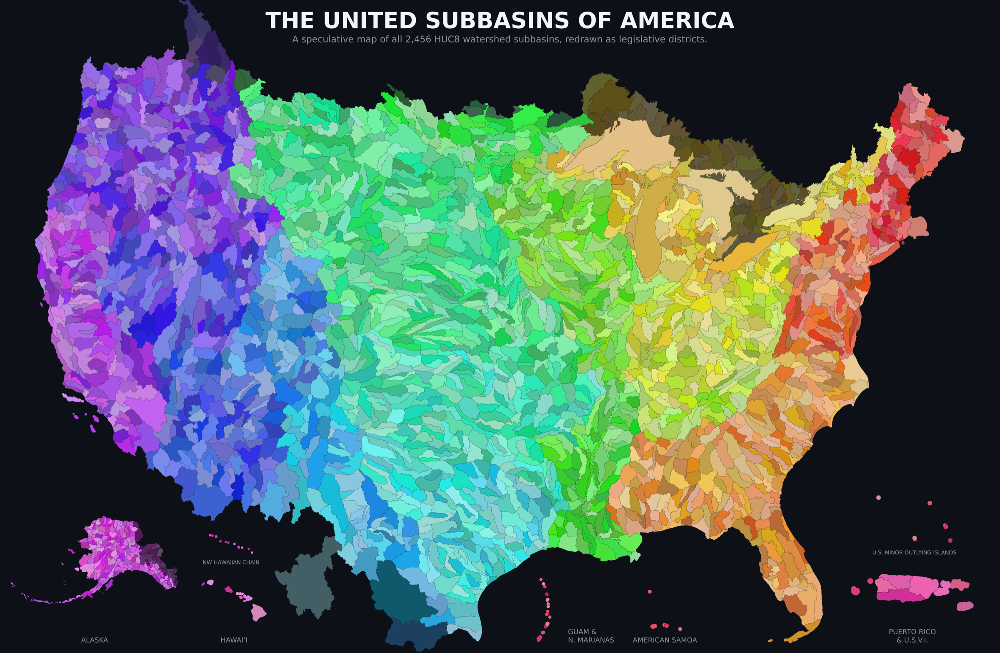

# Estuarymandering

**The United Subbasins of America** — watershed subbasins redrawn as legislative
districts, one representative per watershed.


**Download the map:** [full-resolution PNG](the-united-subbasins-of-america.png) · [print PDF](the-united-subbasins-of-america.pdf) · [lighter web PNG](the-united-subbasins-of-america.web.png)

A speculative cartography: the United States as **2,456 HUC8 watershed
districts**, colored by hydrologic region. Gerrymandering's opposite — districts
drawn by rivers instead of incumbents. Taken literally it is unworkable: an
empty desert basin shouldn't out-vote a dense city. But that is the negotiation
the map wants to start, and representation for the water itself is the opening
bid. An earlier version of this map circulated online without Hawaiʻi; this
repo corrects that and shares the code to produce it (with some caveats, below).

## Reproduce it

```bash
make data      # fetch HUC8 from the USGS WBD REST service -> data/huc8_raw.geojson
make setup     # render deps (geopandas, matplotlib) into .venv, via uv if you have it
make map       # render outputs/united_subbasins_with_hawaii.{png,pdf}
make map-all   # complete edition with PR/USVI, Guam & N. Marianas, Am. Samoa
```

`make data` is standard-library-only: a count preflight, then a few paginated
REST calls (a few MB), generalized server-side. Only the render step needs
geopandas.

The drainage system is fractal, and the negotiation lives in that fact: merge
the empty basins downstream, split the crowded ones at the next tributary,
until each seat carries its share. Swap the HUC level, recolor it, draw your
own subbasin republic.

## Data

USGS *Watershed Boundary Dataset (WBD)*, 8-digit hydrologic units (HUC8), queried
live from The National Map ArcGIS REST service:

- **Service:** <https://hydro.nationalmap.gov/arcgis/rest/services/wbd/MapServer>
- **Layer:** 4 — "8-digit HU (Subbasin)" · **Accessed:** June 2026
- **~2,456 features**, no geographic filter — Alaska, Hawai‘i, Puerto Rico, Guam,
  and American Samoa basins all come along — generalized at
  `maxAllowableOffset = 0.002°` for web weight.
- Every fetch writes `data/manifest.json` (expected vs. received count, endpoint,
  date) so a truncated pull is diagnosable instead of silent.

**A caveat on the number of subbasins:** the hero render above draws CONUS, Alaska, and
the main Hawaiian islands — a map arguing for fairer representation shouldn't
leave the territories off, so a **complete edition** (`make map-all`) seats
every one of the 2,456 basins in some register: Puerto Rico & the U.S. Virgin
Islands, Guam & the Northern Marianas, and American Samoa get insets; the
Northwestern Hawaiian chain and the U.S. Minor Outlying Islands appear in true
arrangement but far off scale; and the Canadian headwaters of the Columbia run
visibly past the top edge of the frame rather than vanishing. (The WBD carries
cross-border units — rivers don't check passports — so basins lying wholly in
Canada or Mexico stay on the complete edition but recede toward the dark
ground: drawn by the river, not seated in the union. The hero map draws them
at full color, 61 Canadian Great Lakes basins among them.)

> Data are queried live; counts may drift slightly as the WBD is revised.

Public domain — <https://www.usgs.gov/national-hydrography/access-national-hydrography-products>.

## Method

Each subbasin's color is a function of its HUC code and nothing else. The
two-digit region prefix picks a base hue, with the 22 hydrologic regions
spaced evenly around the color wheel in numbering order — and because the
USGS numbered its regions roughly east to west (01 is New England, 18 is
California), the rainbow sweep across the country falls out of the data
rather than being painted on. The full eight-digit code is then hashed
into a small hue nudge and a saturation/lightness draw, so adjacent basins
in the same region stay distinct, and any given basin colors identically
in every render and every fork. Boundaries are drawn in the background
color on a dark ground, so the divides read as channels between basins.
The Lower 48 sit in an Albers equal-area projection — a district's visual
weight is its actual area — and each inset gets its own local projection.
These choices date to the script's first draft and were kept because they
worked.

## Background

From a final for **VIS 102, *Democratizing the City*** (UC San Diego, Prof. Teddy
Cruz). The map proposes the watershed as the unit of representation — finishing an
idea the geologist [John Wesley Powell](https://en.wikipedia.org/wiki/John_Wesley_Powell)
brought to Congress in the 1880s, and that Congress declined.

## Appendix: the complete edition

Every basin, in some register — the territories as insets, the island chains
off scale, the wholly-Canadian and -Mexican basins dimmed, the Columbia's
headwaters running past the frame.



**Download:** [full-resolution PNG](the-united-subbasins-of-america.complete.png) · [print PDF](the-united-subbasins-of-america.complete.pdf)

## Layout

```
.
├── bootstrap.sh           # fetch HUC8 from USGS WBD REST -> data/
├── Makefile               # make data / setup / map / map-all
├── scripts/
│   ├── fetch_huc8.py      # WBD REST -> data/huc8_raw.geojson (+ manifest), stdlib only
│   ├── render_map.py      # the hero map: dark-ground region hues (+ AK, Hawaiʻi)
│   └── render_map_all_territories.py   # complete edition: + PR/USVI, Marianas, Am. Samoa
├── data/                  # fetched (gitignored)
└── outputs/               # renders (gitignored)
```

## License

Code: **MIT** (see [`LICENSE`](LICENSE)). The rendered map image: **CC BY 4.0** —
reuse it anywhere, just credit *Lance Robertson*, so the attribution travels
when it circulates.

---

*Brought to you by Lance "it's ya boi" Robotson.*
