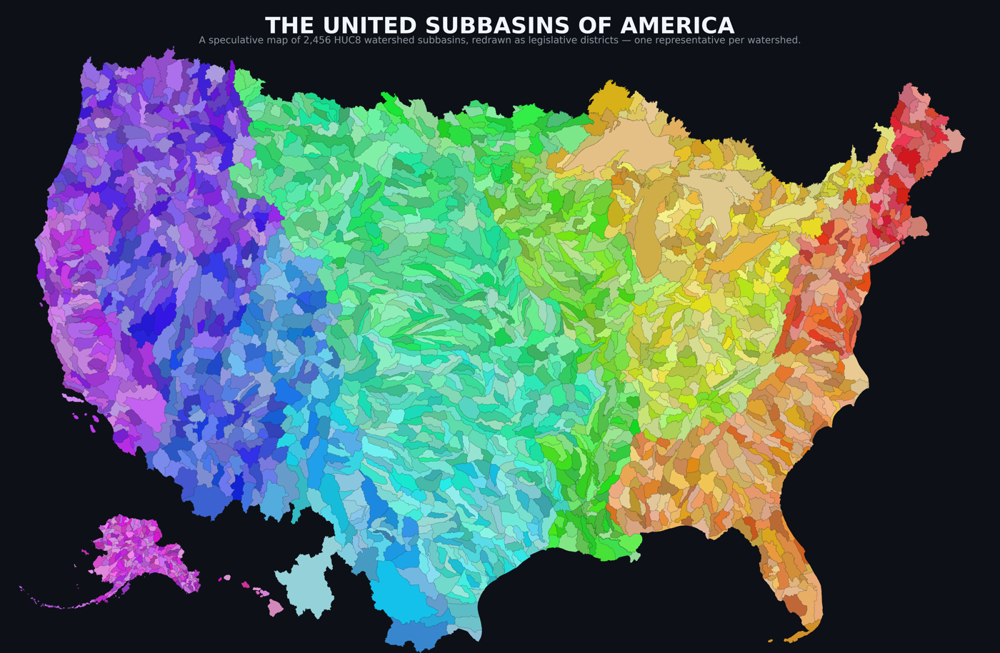

# Estuarymandering

What if congressional representation followed **water** instead of party?

This repo renders *The United Subbasins of America* — the United States redrawn
as **2,456 watershed districts**, one HUC8 subbasin per seat — in the style of a
campaign map. Gerrymandering's opposite: districts drawn by rivers instead of
incumbents.



## What it does

Pulls every HUC8 subbasin from the USGS Watershed Boundary Dataset, colors each
by its major hydrologic region (with a deterministic per-basin jitter so
neighbors stay distinct), and draws the Lower 48 in Albers equal-area projection
with Alaska and Hawai‘i as insets. Color is **geography, not data** — a portrait
of the country's drainage, asked to stand in for its politics.

## Quick start

```bash
make data      # fetch HUC8 from the USGS WBD REST service -> data/huc8_raw.geojson
make setup     # install render deps (geopandas, matplotlib)
make map       # render outputs/united_subbasins_with_hawaii.{png,pdf}
```

`make data` needs nothing but Python's standard library — it's two paginated
REST calls (a few MB), generalized server-side to web weight. Only the render
step needs geopandas.

## Data

USGS *Watershed Boundary Dataset (WBD)*, the 8-digit hydrologic units (HUC8),
fetched live from The National Map's ArcGIS REST service — **layer 4, ~2,456
features**, public domain.

Service: <https://hydro.nationalmap.gov/arcgis/rest/services/wbd/MapServer>

> There's also a ~3 GB national GeoDatabase if you ever want the whole thing —
> this repo deliberately doesn't. It asks the server for exactly the layer it
> needs and nothing else.

## Layout

```
.
├── bootstrap.sh           # fetch HUC8 from USGS WBD REST -> data/
├── Makefile               # make data / setup / map
├── requirements.txt
├── scripts/
│   ├── fetch_huc8.py      # WBD REST service -> data/huc8_raw.geojson  (stdlib only)
│   └── render_map.py      # the dark-ground region-hue map (+ Hawaiʻi)
├── data/                  # populated by bootstrap (gitignored)
└── outputs/               # rendered PNG / PDF (gitignored)
```

## Concept

From a final for **VIS 102, *Democratizing the City*** (UC San Diego). The map
proposes the watershed as the unit of representation — finishing an idea the
geologist John Wesley Powell brought to Congress in the 1880s, and that Congress
declined. See Susan Schulten, "This 19th-Century Map Could Have Transformed the
West," *The New Republic*, 2014.

## License

Code: MIT. Map data: USGS, public domain.
